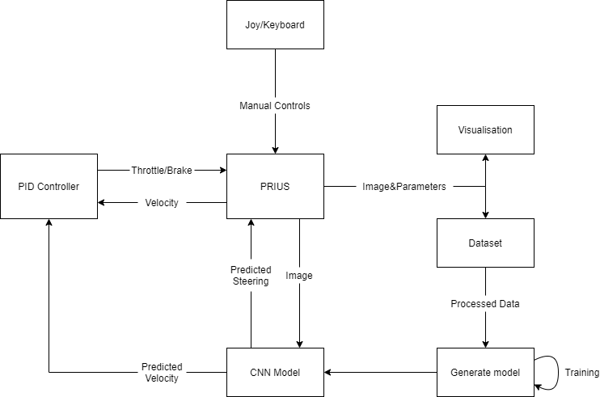

# Autonomous vehicle

## Dependencies
* Docker
* Ubuntu 18 or Ubuntu 20

## Goal
The goal of the project was to add the following functionalities to a simulated car in gazebo environment:
* Steering with keyboard/joystick
* First person visualisation
* Collecting visual data
* Autonomous drive

## How does it work?
The following diagram shows the idea behind the entire system:

* Prius - Vehicle's velocity, steering, front camera image and steering inputs
* Joy/Keyboard - Controls the vehicle, allows to turn data collection on/off and to choose between manual and autonomous steering
* Visualisation - Shows front's camera image, vehicles velocity and current steering
* Dataset - A dataset of collected images and its labels - steering and velocity
* Generate model - A Python script that uses collected data to create a CNN model
* CNN model - A generated model that uses front camera's image to predict vehicle's velocity and steering
* PID controller - An addition to predicted velocity, allows to modify vehicle's performance after the model is trained.

## Convolutional Neural Network

Three convolutional networks models were considered during the implementation

* ResNet
* EfficientNet
* [Network by github.com/maxritter](https://github.com/maxritter/SDC-End-to-end-driving?fbclid=IwAR3Md7GCu1JMYJ-xzSEOihjX94t30AZDxypfHpQWLQ1J06Dri437TFBLtrY)

The third, customised architecture seemed to give the best results. With a modification of a few layers, the network was ready for training. The initial data collected from the front camera had the dimensions of 800x800. Because most of the image contained the sky and vehicle's hood, only 220x800 part of the image was taken into account and then resized to 200x200 RGB image.

Architecture of the created model:

The `train/CNN.py` script includes the preprocessing and training of the CNN model.

## Scripts

The scripts are contained in 'av_07/scripts'. Every Python script creates an individual rosnode and subscribes/publishes following data:
* controller_node - Subscribes the input from joystick/keyboard, allows to control the vehicle, turn on the data collection and autonomous steering
* states_node - Subscribes car's global x,y,z velocities and publishes them as one vector
* visualiser_node - Subscribes car's front camera image, and its current parameters and displays them in a new window
* collector_node - Subscribes car's front camera image, its current velocity and steer and saves them in data folder
* control_prediction_node - Subscribes car's front camera image and predicts its velocity and steer using the CNN model

